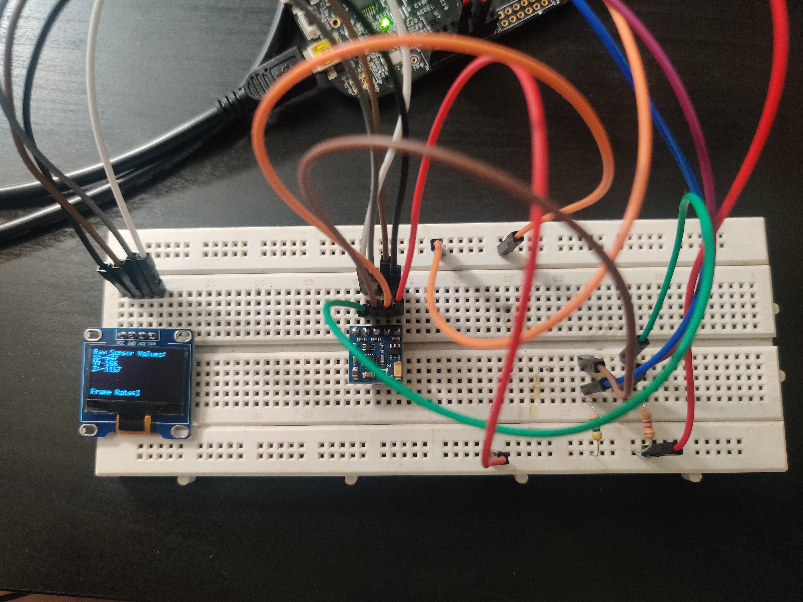

# PES Final Project: Digital Compass using QMC5883L Magnetometer + SSD1306 Based 128*64 Display

- [PES Final Project: Digital Compass using QMC5883L Magnetometer + SSD1306 Based 128\*64 Display](#pes-final-project-digital-compass-using-qmc5883l-magnetometer--ssd1306-based-12864-display)
  - [Project Introduction](#project-introduction)
    - [Functionality:](#functionality)
      - [Display Driver](#display-driver)
      - [QMC5883L Driver](#qmc5883l-driver)
  - [Tools Used](#tools-used)
  - [Peripherals Used](#peripherals-used)
  - [External Devices/ Components Used](#external-devices-components-used)
  - [State Machine](#state-machine)
  - [Display Driver](#display-driver-1)
  - [Magnetic Calibration Process](#magnetic-calibration-process)
  - [Link to Video Demo](#link-to-video-demo)
  - [Testing Procedure](#testing-procedure)
    - [Display](#display)
    - [Magentometer](#magentometer)
  - [References](#references)

## Project Introduction
To make a bare metal SS1306 OLED driver and integrate it with a QMC5883L
Compass module to render data onto the display. It will also use an underlying
state machine to change between different renderings to be shown on the display.

### Functionality: 
#### Display Driver

- Negative Image – the ability to switch between a positive image and
a negative image on the display

- Reverse Display – the ability to flip the image to display a mirrored
version

- Orient Image – the ability to flip the image to display an upside-down
version

- Frame Rate Calculation – the ability to calculate the frame rate of the
display, this can be used for system testing and diagnosis

#### QMC5883L Driver
- To obtain the compass heading and render it on the display
- To calibrate the device for accurate readings

## Tools Used
- **IDE**: MCUXpresso v11.8.0
- **SDK**: SDK version 2.2.0 package for FRDM-KL25Z board
- **Developement Board**: FRDM-KL25Z
- **State Diagram**: Microsoft Visio

## Peripherals Used
- **Systick**
- **I2C**

## External Devices/ Components Used
- **QMC5883L**: 3 Axis Magnetometer
- **SSD1306 128*64 DISPLAY**
- **4.7K Pullup Resistors**
- **Jumper Wires**

## State Machine
The device starts up in a display test state where a test sequence is run on the display where it all characters from the font table are printed on the screen. Negative Display, Display Mirroring, Display Flipping are all tested in this state. After the time for this state expires the system enters the raw data display state where the raw 16-bit sensor readings from each axis is displayed on the screen. When the timer for that state expires, the system enters the display direction state where the calulated magnetic azimuth is displayed on the screen. After timer expiry in this state, the systems enters the raw data display state once more. The diagram of the state machine can be viewed in the file "state_machine.pdf"

## Display Driver
It is based on a frame buffer, where changes for the new frame are made onto a virtual frame present in memory, and after that the entire display is update with this new virtual frame. The implementation is simpler than manually keeping track of where elements have been rendered on the screen and where do they need to be erased from.

Images of the Display in Action:

Negative Display

Raw Data Screen

Direction Data Screen

## Magnetic Calibration Process
Based on reference [2], i have created a python script that can provide the scale and offset required to calibrate the reading from each axis. The calibrated value for the reading is provided with the following formula.

Calibrated Axis Data = scale*(raw_reading - bias)

The calibration python script requires a text file of the readings from the magnetometer where it is moved in a figure 8 pattern randomly, so as to cover all ranges of input. The readings can be obtained by running the qmc_dump_calibration_data() command from the driver.

Output of Magnetic Calibration Process. The Data should be a circle centered on (0,0), for for this project the accuracy provided by the simple calibration is good enough.

## Link to Video Demo
[Video Demonstartion](https://drive.google.com/file/d/1KHImZPY8Tf0WBpYH8ufDYp31U3xZs0i8/view?usp=sharing)

## Testing Procedure

### Display
A self-test sequence is provided on the start of the state machine where the display runs through all of its configuration. This test state can be observed for Display Ram Mapping Issue( if characters are not printed properly) or for dead pixels etc

### Magentometer
Two facilites for calibration are provided, on board and an accompanying python file. The python file based calibration is more accurate since it provides a scale factor as well. Incase of inaccurate reading, recalibration must be done. 

## References
1. Font: https://github.com/adafruit/monochron/blob/master/firmware/font5x7.h
2. Magnetometer Calibration Process: https://github.com/kriswiner/MPU6050/wiki/Simple-and-Effective-Magnetometer-Calibration